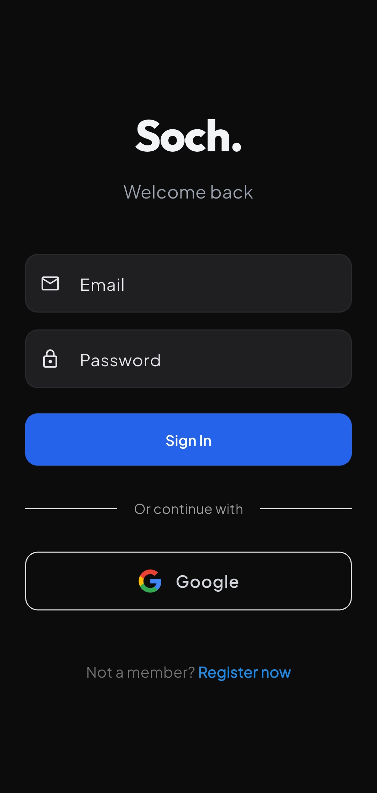
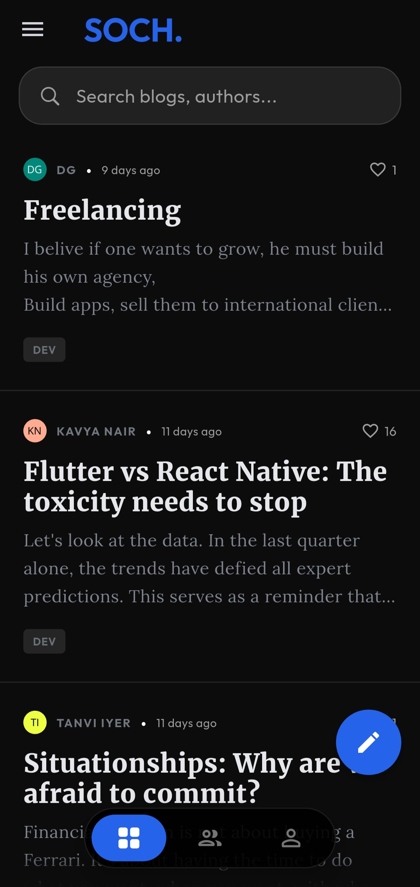
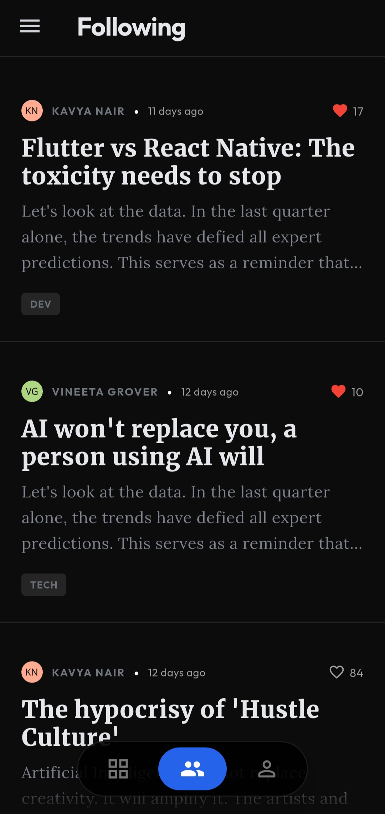
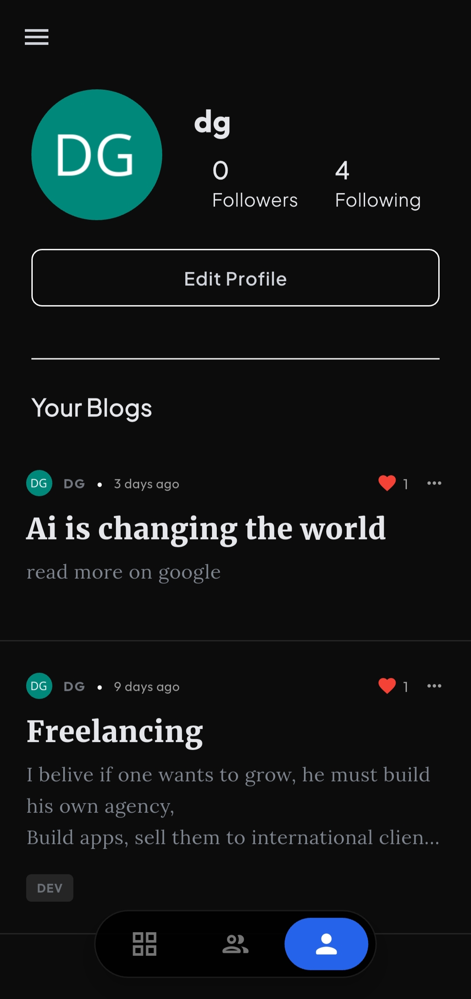

# SOCH. 

<div align="center">


<br>

[](https://drive.google.com/file/d/1tFKfIE9-pdSzi4taIg8xTIblCEC1TMRW/view?usp=sharing)

**A Modern, Premium Platform for Sharing Thoughts.**

[Features](#key-features) • [Architecture](#architecture) • [Tech Stack](#tech-stack) • [Screenshots](#screenshots)

</div>

---

## 💡 Introduction

**Soch** (meaning "Thought" in Hindi/Urdu) is a premium blogging and social platform built with **Flutter** and **Firebase**. It allows users to express their ideas, explore trending content, and connect with a community of thinkers.

Designed with a focus on **User Experience (UX)**, the app features a sleek, minimalist interface, smooth transitions, haptic feedback, and a robust dark mode. Under the hood, it demonstrates **production-grade** coding practices, including a scalable **Service-Oriented Architecture**, real-time data synchronization, and cloud-native backend integration.

## ✨ Key Features

*   **🔍 Powerful Search**: Explore new content and discover authors with an integrated search experience, featuring Hero animations and instant filtering.
*   **🔐 Secure Authentication**: Seamless onboarding with Google Sign-In and Email/Password authentication, managed via Firebase Auth.
*   **📡 Real-time Feed**: Instant updates on new blogs and interactions using Cloud Firestore streams.
*   **✍️ Rich Content Creation**: Intuitive blog editor for composing thoughts and stories.
*   **🔔 Smart Notifications**: Integrated **Firebase Cloud Messaging (FCM)** for push notifications and local notifications for foreground alerts.
*   **🎨 Premium UI/UX**:
    *   Custom animated navigation bar.
    *   Subtle haptic feedback for interactions.
    *   Fade transactions and skeleton loaders for smooth perceived performance.
    *   Fully adaptive **Dark & Light Mode**.
*   **👤 Social Integration**: Follow users, like posts, and build a personalized profile.

## 🏗️ Architecture

The project follows a clean **Service-Oriented Architecture** to ensure separation of concerns, testability, and scalability.

```
lib/
├── main.dart           # Application Entry Point
├── main_wrapper.dart   # Auth State Wrapper & Root Navigation
├── models/             # Data Models (User, Blog, Comment)
├── screens/            # UI Layer (MVVM/MVC pattern)
├── services/           # Business Logic & API Layer (Singleton Pattern)
│   ├── auth_services.dart
│   ├── blog_services.dart
│   ├── user_services.dart
│   └── notifications/  # Notification Handling Logic
├── utils/              # Constants, Themes, Helpers
└── widgets/            # Reusable UI Components
```

### Design Patterns Used:
*   **Singleton Pattern**: For Services (`AuthService`, `UserService`) to ensure a single instance manages resources.
*   **Repository Pattern**: Abstracting data sources (Firestore) from the UI.
*   **Observer Pattern**: Utilizing Dart `streams` for real-time state updates (e.g., Auth State, Data Feeds).
*   **Component-Based UI**: High reuse of custom widgets (`widgets/`) for consistent design.

## 🛠️ Tech Stack

*   **Frontend**: Flutter (Dart)
*   **Backend**: Firebase (Serverless)
    *   **Authentication**: Identity management.
    *   **Cloud Firestore**: NoSQL database for scalable data storage.
    *   **Cloud Messaging (FCM)**: Push notifications.
*   **State Management**: Native `StreamBuilder` & `FutureBuilder` for reactive data flow + `setState` for ephemeral UI state.
*   **Packages**: `google_fonts`, `flutter_local_notifications`, `cached_network_image`, `timeago`.

## 📱 Screenshots

| Login & Splash | Home Feed | Blog Details |
|:---:|:---:|:---:|
|  |  |  |

| Following Feed | Profile | Light Mode |
|:---:|:---:|:---:|
|  |  |  |

---

<div align="center">
  <p>Built with ❤️ by Divyansh </p>
</div>
